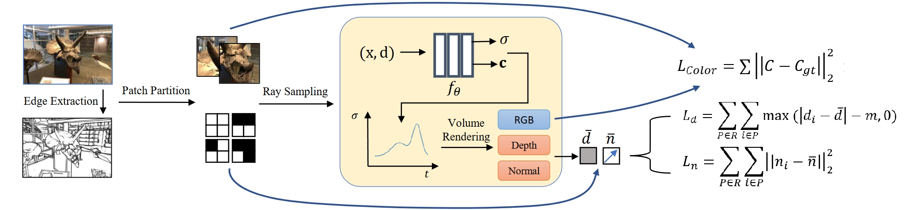

# EdgeNeRF: Edge-Guided Regularization for Neural Radiance Fields from Sparse Views




## Installation

We recommend to use [Anaconda](https://www.anaconda.com/products/individual) to set up the environment. First, create a new `regnerf` environment: 

```conda create -n regnerf python=3.6.15```

Next, activate the environment:

```conda activate regnerf```

You can then install the dependencies:

```pip install -r requirements.txt```

Finally, install jaxlib with the appropriate CUDA version (tested with jaxlib 0.1.68 and CUDA 11.0):

```pip install --upgrade jaxlib==0.1.68+cuda110 -f https://storage.googleapis.com/jax-releases/jax_releases.html```

Note: If you run into problems installing jax, please see [the official documentation](https://github.com/google/jax#pip-installation-gpu-cuda) for additional help.

## Data

### DTU Dataset

**Image Data:** Please download the Rectified image and pose data from [the official publication](https://roboimagedata.compute.dtu.dk/?page_id=36).

**Mask Data:** For evaluation, we report also masked metrics (see [Fig. 3 of the main paper](https://drive.google.com/file/d/1S_NnmhypZjyMfwqcHg-YbWSSYNWdqqlo/view) for an in-depth discussion). For this, we use the object masks provided by [DVR](https://github.com/autonomousvision/differentiable_volumetric_rendering) and [IDR](https://github.com/lioryariv/idr) and further create them ourselves for the remaining test scenes. You can download the full mask data here: https://drive.google.com/file/d/1Yt5T3LJ9DZDiHbtd9PDFNHqJAd7wt-_E/view?usp=sharing

### LLFF dataset

**Image Data:** Please use [the official download link](https://drive.google.com/drive/folders/128yBriW1IG_3NJ5Rp7APSTZsJqdJdfc1) from the [NeRF repository](https://github.com/bmild/nerf) for downloading the LLFF dataset.


## Running the code

### Training an new model

*Disclaimer:* The code release does not include the flow model and hence also not the appearance regularization loss. For obtaining results of our full model, please use the provided checkpoints (see below). Running this provided code on a GPU machine, we obtain a mean masked PSNR of 21.37 compared to the previous 21.48 on Scan 114 (Buddha scene) of the DTU dataset. See `other/comparison_masked_psnr.txt` for a per-image comparison. This is in line with [our ablation study in Tab. 3 of the main paper](https://drive.google.com/file/d/1S_NnmhypZjyMfwqcHg-YbWSSYNWdqqlo/view) where we ablate the appearance loss on the entire dataset.

For training a new model from scratch, you need to first need to define your CUDA devices. For example, when having access to 8 GPUs, you can run

```export CUDA_VISIBLE_DEVICES=0,1,2,3,4,5,6,7```

and then you can start the training process by calling

```python train.py --gin_configs configs/{CONFIG} ```

where you replace `{CONFIG}` with the config you want to use. For example, for running an experiment on the LLFF dataset with 3 input views, you would choose the config `llff3.gin`. In the config files, you might need to adjust the `Config.data_dir` argument pointing to your dataset location. For the DTU dataset, you might further need to adjust the `Config.dtu_mask_path` argument. The `*_bl.gin` configs are the mip-NeRF baseline configurations.

Once the training process is started, you can monitor the progress via the tensorboard by calling
```
tensorboard --logdir={LOGDIR}
```
and then opening [localhost:6006](http://localhost:6006/) in your browser. `{LOGDIR}` is the path you indicated in your config file for the `Config.checkpoint_dir` argument. 

### Rendering test images

You can render and evaluate test images by running

```python eval.py --gin_configs configs/{CONFIG} ```

where you replace `{CONFIG}` with the config you want to use. Similarly, you can render a camera trajectory (which we used for our videos) by running

```python render.py --gin_configs configs/{CONFIG} ```